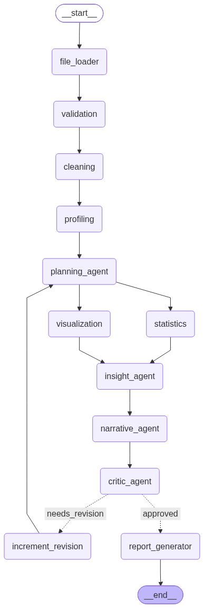

# AutoInsight AI — Autonomous Data Analytics Platform

Upload any business CSV/Excel dataset and get back a cleaned dataset, full EDA,
and an executive-ready PDF report — built by a multi-agent LangGraph system
that plans its own analysis, critiques its own output, and revises when its
own standards aren't met.

**Live demo:** [your Hugging Face Space URL here]
**Video walkthrough:** [your demo video link here]

---

## Architecture



### 3 Real Agents (LLM-powered reasoning)
- **Planning Agent** — reads the dataset profile and decides which analyses/charts fit this specific data
- **Insight & Narrative Agents** — turn raw statistics into grounded, numbers-cited business language
- **Critic Agent** — reviews the full analysis and can send it back to Planning with specific feedback (reflection loop)

### 7 Pipeline Nodes (deterministic, no LLM)
File Loader, Validation, Cleaning, Profiling, Statistics, Visualization, Report Generator — each takes state in, produces state out, same input always produces same output.

### Key engineering decisions
- **Reflection loop with a safety valve** — Critic can reject and loop back to Planning up to a capped limit, with a no-progress detector that stops the loop early if feedback repeats
- **Checkpointing (SQLite + WAL mode)** — every node's output is saved; a killed process resumes instead of restarting; `thread_id` doubles as the job identity across the FastAPI layer
- **Fan-out/fan-in parallel execution** — Statistics and Visualization run concurrently after Planning, merging before the Insight Agent
- **LangSmith observability** — every LLM call tagged by agent role, traceable by job ID

---

## Tech Stack

| Layer | Technology |
|---|---|
| Orchestration | LangGraph, LangChain |
| LLM | Groq (Llama 3.3 70B) |
| Backend | FastAPI |
| Data | Pandas, NumPy |
| Charts | Matplotlib |
| Reports | ReportLab |
| Observability | LangSmith |
| Frontend | Vanilla HTML/CSS/JS |
| Deployment | Docker, Hugging Face Spaces |

---

## Running Locally

```bash
git clone <your-repo-url>
cd autoinsight-ai
python -m venv venv
venv\Scripts\activate          # Windows
pip install -r requirements.txt

# Create .env with:
# GROQ_API_KEY=your_key
# LANGCHAIN_TRACING_V2=true
# LANGCHAIN_API_KEY=your_langsmith_key
# LANGCHAIN_PROJECT=autoinsight-ai

uvicorn app.main:app --reload
```
Visit `http://127.0.0.1:8000`

---

## Known Limitations (honest, by design)

- Segmentation, forecasting, and what-if analysis are intentionally out of scope for this MVP — they require trained ML models with proper validation, not LLM guesses. Faking them would produce confident-sounding but unreliable numbers.
- Free-tier LLM rate limits (Groq) can throttle heavy back-to-back usage; production use would need a paid tier or a queue.
- Uploaded files persist on disk with no automatic cleanup job — fine for a demo, would need a retention policy in production.

---

## What This Project Demonstrates

- Honest separation between orchestration (pipeline nodes) and agency (LLM reasoning) — not just labeling everything "AI"
- A genuine self-correcting reflection loop, not just a linear pipeline
- Production concerns tackled directly: checkpointing, structured logging, retry-with-backoff, error boundaries tagged to the exact failing node, security hardening (file size limits, path traversal protection, CORS)
- Debugging real bugs on real messy data (see `BUGS_FOUND.md`) rather than only testing on clean hand-picked samples
